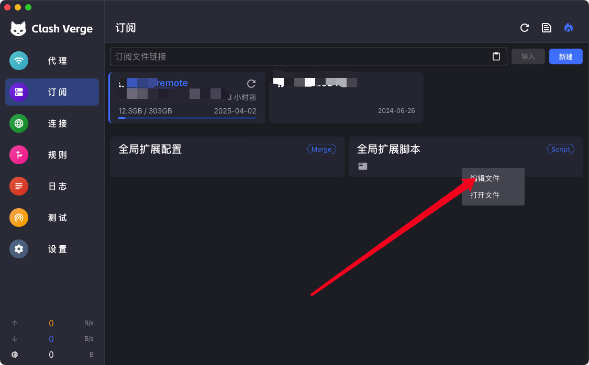
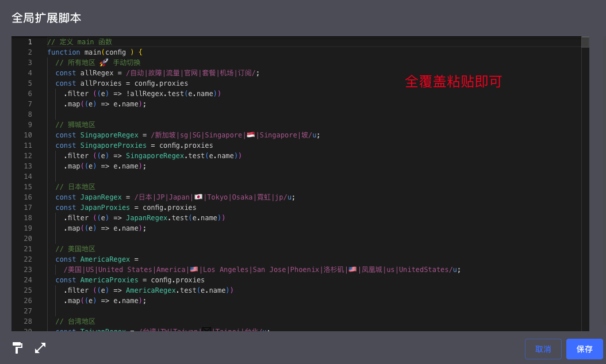
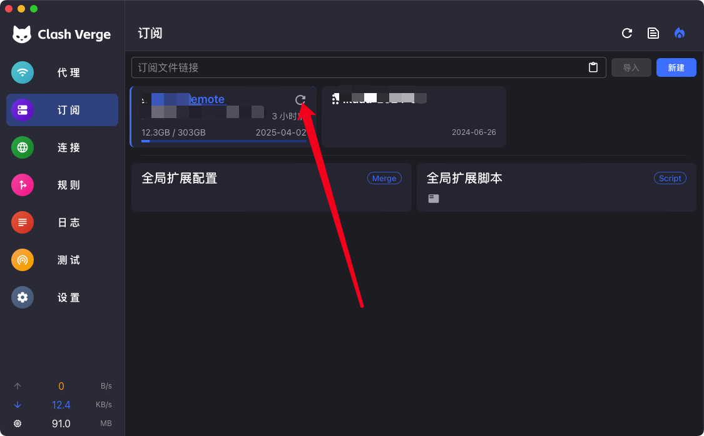
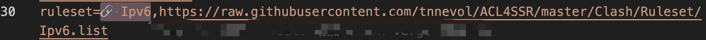
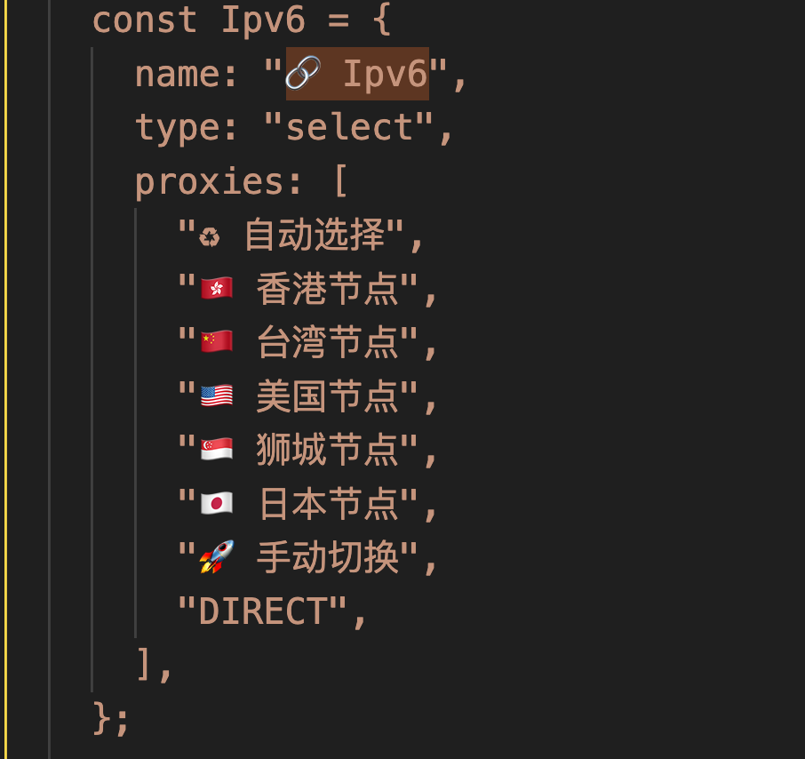

# SSR去广告规则/GFWList规则/Clash规则碎片/ClashVerge Script

* 这个项目是本人 fork 于 [ACL4SSR](https://github.com/ACL4SSR/ACL4SSR) 项目，主要是提供本人的定制化分流规则，用于 clash 规则和 clash verge script 规则。
* 原项目请至 [ACL4SSR](https://github.com/ACL4SSR/ACL4SSR/tree/master)。

# 在 clash verge script 中使用

 项目 ClashVerge 目录下下有 [ACL4SSR_Online_Full.js](https://github.com/tnnevol/ACL4SSR/blob/master/ClashVerge/dist/scripts/ACL4SSR_Online_Full.js) 脚本，该脚本加入了一些定制的规则内容。

 ## 使用
  
  复制 [ACL4SSR_Online_Full.js](https://github.com/tnnevol/ACL4SSR/blob/master/ClashVerge/dist/scripts/ACL4SSR_Online_Full.js) 中的内容，粘贴到 Clash verge 的 __全局扩展__ 或 __指定订阅__ 脚本中。

  
  
  

  ## 增加规则

  增加 ipv6规则
  

  增加 ipv6 组
  

  增加脚本 https://github.com/Aethersailor/Custom_Clash_Rules/blob/main/cfg/Custom_Clash_Full.ini